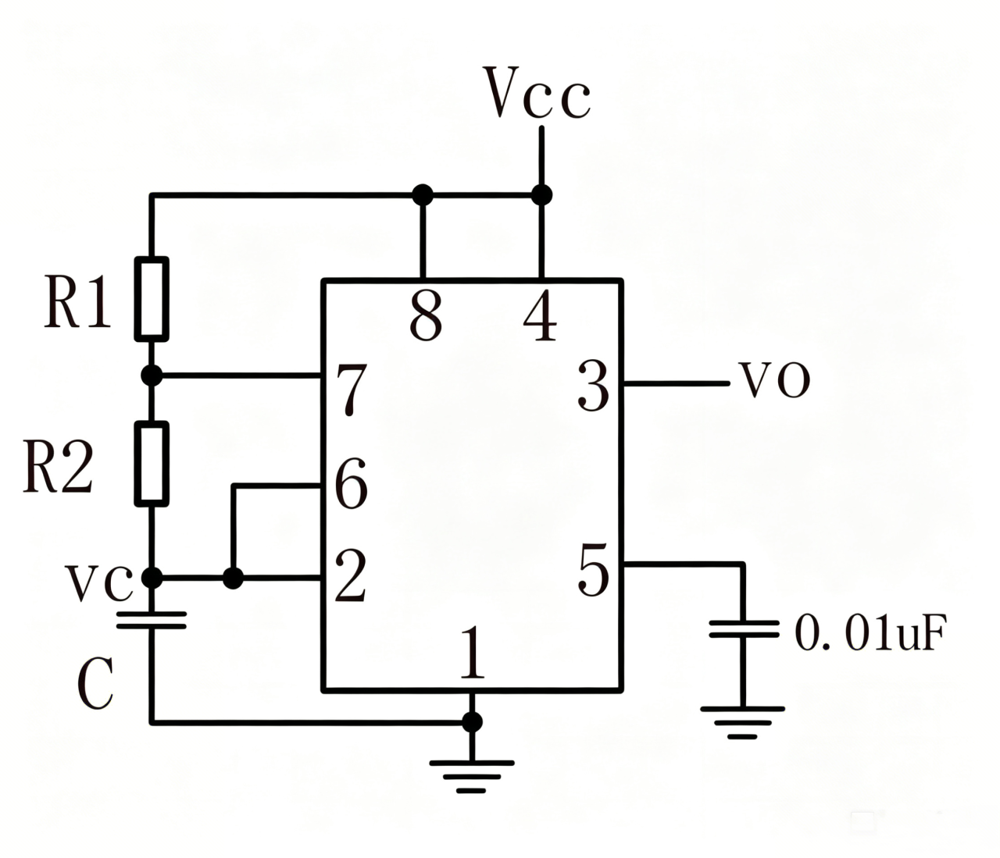
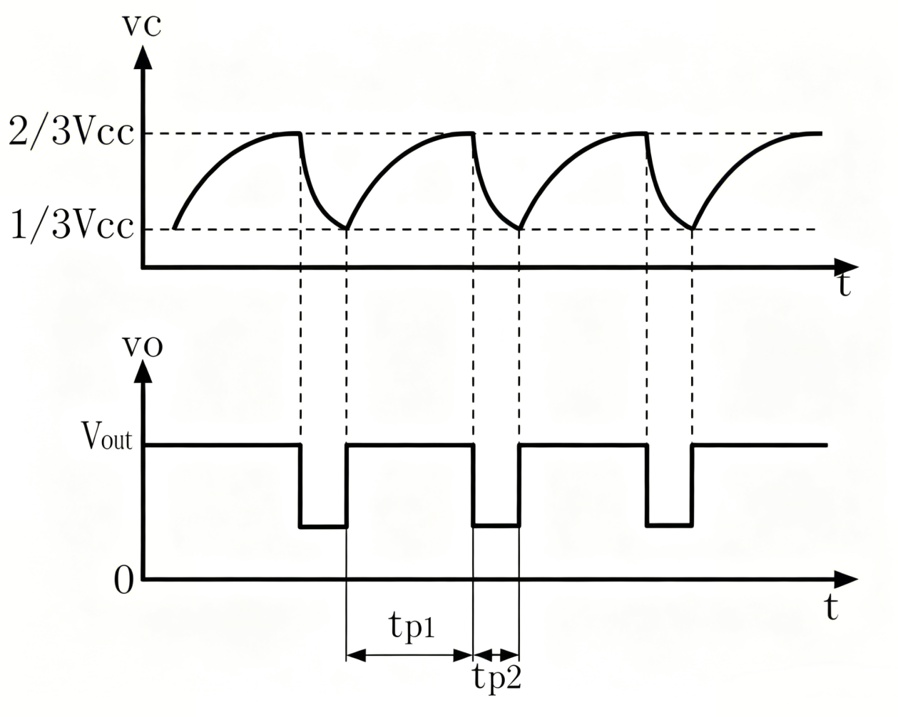
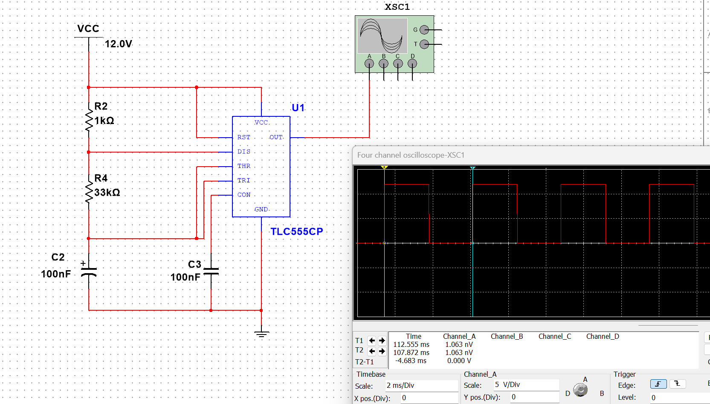
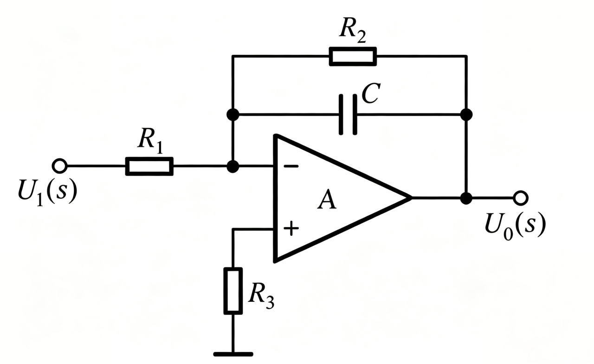
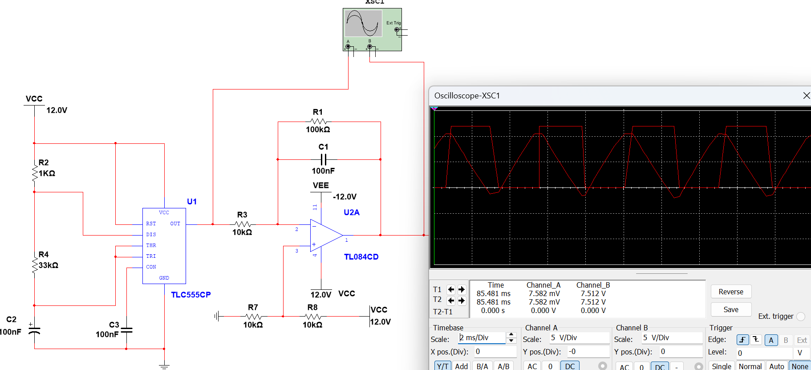
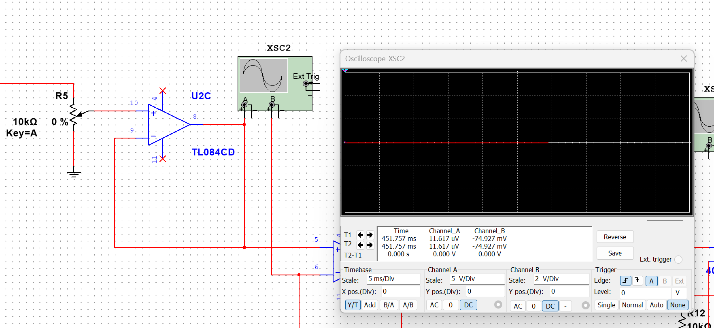
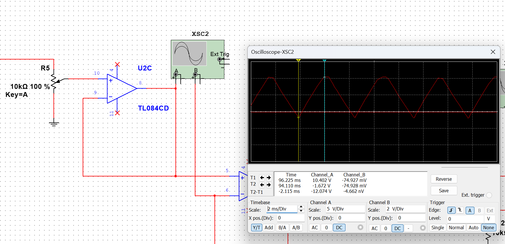
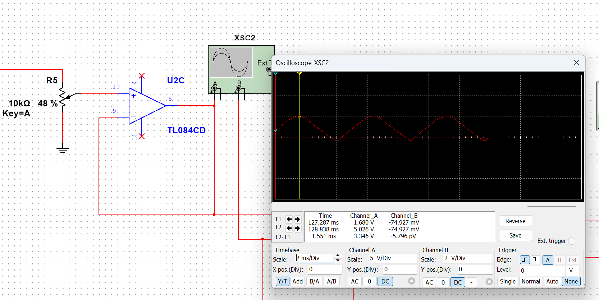
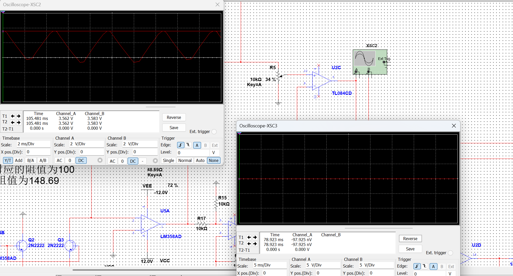
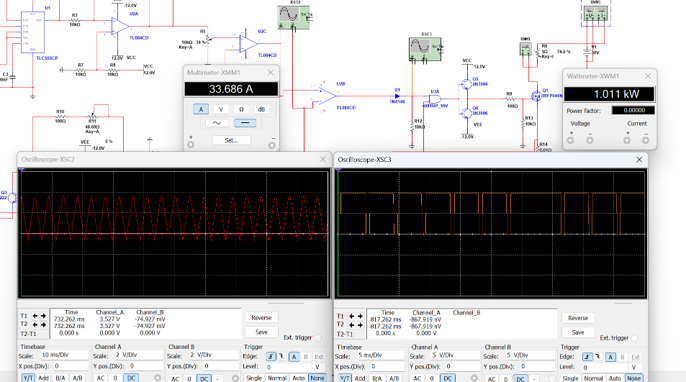

# PWM产生与功率驱动

## 1.设计思路

需满足要求：  
①额定加热器工作电压直流30V，最大加热功率1KW。  
②温度控制范围：可设定目标温度40-90℃。  
③采用PWM功率调节控制：通过PWM信号控制MOSFET或IGBT开关，调节加热元件功率。  

功率：

$$
P = UI
$$

工作电压 U 固定，只能改变 I。

欧姆定律：

$$
I = \frac{U}{R}
$$

加热器电阻 R 基本固定，只能改变加热器两端有效电压。则使用占空比可调的PWM波当成“开关”控制电路，开关开的时间长，关的时间短，平均电压就高，功率就大；反之则小。

三角波与可调的直流电压（目标温度）进行比较，比较就产生了占空比可变的PWM波：温度相差越大，输出高电平的时间就越长，占空比越大，加热功率也就越大。

三角波可由方波转换得到，方波可由555定时器产生。

---

## 2.PWM产生电路

### （1）方波产生

使用555定时器构成无稳态多谐振荡电路。

#### 原理：

①VCC经电阻R1、R2对电容C充电，使 vc 逐渐升高，上升到：

$$
\frac{2}{3}V_{CC}
$$

时，555定时器输出：

$$
v_o=0
$$

（定时器内比较器C1的输出，即基本SR触发器的R跳变为低电平，比较器C2的输出即基本SR触发器的S端跳变为高电平，使基本SR触发器置0有效，输出端OUT即 vo=0，放电管T导通。）

②电容C通过电阻R2和7脚的放电管T放电，使 vc 下降。当 vc 下降到：

$$
\frac{1}{3}V_{CC}
$$

时，555定时器输出：

$$
v_o=1
$$

（比较器C1的输出即基本SR触发器的R端跳变为高电平，比较器C2的输出即基本SR触发器的S端跳变为低电平，使基本SR触发器置1有效，输出端OUT即 vo 又由0变为1，放电管T截止。）

③VCC又经电阻R1、R2对电容C充电，使 vc 再次升高。重复上述过程，在输出端 vo 就产生了连续的矩形脉冲。

其在无稳态模式下的振荡频率公式为：

$$
f \approx \frac{1}{\ln 2 \cdot C \cdot (R_1 + 2R_2)}
$$

输出高电平时间为：

$$
t_{high} = \ln 2 \cdot (R_1 + R_2)\cdot C
$$

输出低电平时间为：

$$
t_{low} = \ln 2 \cdot R_2 \cdot C
$$

取：

$$
R_1=1K,\quad R_2=33K,\quad C=100nF
$$

则：

$$
f=215Hz
$$

---

### （2）三角波产生

使用积分电路将方波转为三角波。

输入与输出电压关系（电阻R2为了构成直流负反馈，防止运放进入饱和状态）：

$$
v_o=-\frac{1}{RC}\int v_i\,dt
$$

取时间常数：

$$
\tau = RC =1
$$

取：

$$
R_1=10K,\quad R_2=100K,\quad C=100nF
$$

由于使用单电源供电，方波幅值为0V到12V，为使三角波在0V到12V波动。在同相输入端构建分压器，添加电阻R7、R8串联，为串联电阻提供0V到12V的电压，则取两电阻的中间电压即6V接到同相输入端实现三角波上移。

---

### （3）设定温度且产生占空比可调的PWM波（依靠改变三角波幅值）

可调电阻R5百分比为0时，三角波幅值为0V。

可调电阻R5百分比为110时，三角波幅值为12.074V。

为配合实际测量温度转化来的0V到5V电压，控制三角波最大值为5V，即百分比为48%，此时对应的温度为125。

电压跟随器U2C隔离前后级电路，防止后面的负载影响可调电阻分压值。

比较器U2B同相输入端接收温度设定，反相输入端接受实际温度转化来的0到5V信号，通过比较输出占空比可调的PWM波。

实际测量温度控制的电位器100%时对应125°，32%对应40°，72%对应90°。

可调电阻R5，48%时对应125°，14%对应40°，34%对应90°。

温度与电位器百分比关系：

$$
T \approx 2.7P
$$

其中：

- T：设定温度
- P：可调电阻R5百分比

温度相等时，占空比为0；温度相差越大，占空比越大。

---

## 3.功率驱动电路

### （1）
二极管D1起到隔离的作用，防止后级电压倒灌。

### （2）
与门U3A作为安全开关，通过保护信号控制是否通过PWM信号。

### （3）

使用推挽电路驱动MOSFET管，2N3904的NPN型三极管与2N3906的PNP型三极管构成。

推挽电路作为电流缓冲器，使得能高效、快速驱动MOSFET管。

与门输出高电平时，2N3904导通，从正12V汲取电流，快速为Q1充电，使其快速导通；

与门输出低电平时，2N3906导通，通过-12V的VEE提供低阻抗路径，快速为栅极电容的电荷放电至负电压，确保Q1可靠、快速关断。

一推一拉的模式极大提高了栅极驱动能力，确保高效开关。

### （4）

选择MOSFET作为开关。

继电器机械结构无法实现PWM需要的高频开关，三极管开关大电流也会需要不小的基极电流，所以选择MOSFET。

电源30V，最大电流33A，为留有余量，选择55V、50A的，则选择IRFP044N。

### （5）

R9串联在U3A输出和MOSFET栅极之间，作为栅极串联电阻，用于抑制栅极振荡和减少峰值电流，保护MOSFET。

R12连接在D1阴极和地之间，作为下拉电阻，确保当D1截止时，U3A输入被拉低到地，防止浮空输入引起的误触发。

电阻R14可检测电流。

### （6）

可调电阻R6充当负载，通过电流表XMM1可以检测负载两端电流。

30V直流电源为负载提供能源，通过功率表可显示负载功率（电流表串联在负载和30V电源间，电压表直接并联在30V工作电压两端）。

---

## 4.元器件选型依据

### （1）U1：TLC555CP

是CMOS版本的555定时器，具有低功耗、宽工作电压范围（通常2V至15V）和高输入阻抗的特点。

这里电源电压为12V，TLC555CP能够稳定工作，且CMOS技术减少了功耗和热损耗，适合用于振荡电路生成方波信号。

### （2）U2A、U2C：TL084CD

是JFET输入运算放大器，具有高输入阻抗、低输入偏置电流和低噪声特性。

适合信号调理应用，因为它能有效处理高阻抗信号源，减少加载效应。

电源电压12V在其工作范围内（通常±5V至±15V），且单电源设计需要中间偏置，TL084CD能够处理交流信号与直流偏置。

### （3）U2B：TL084CD

因其高输入阻抗允许直接连接来自U2C和外部信号的输入，避免信号衰减。

TL084CD的摆率足够快，适合比较器应用。

### （4）二极管D1（1N4148）

1N4148是高速开关二极管，具有快速恢复时间和低漏电流。

这里用于整流或逻辑隔离，确保只有高电平信号才能通过与门U3A。

其开关速度适合处理运放输出的变化信号。

### （5）与门U3A（4081BP_10V）

4081BP是CMOS 2输入与门，工作电压范围宽（通常3V至15V），这里电源12V在其范围内。

### （6）场效应管Q1（IRFP044N）

IRFP044N是N沟道功率MOSFET，具有高电流能力（连续漏极电流可达50A）、低导通电阻（约0.02Ω）和高耐压（55V），适合高频PWM功率控制场景。
